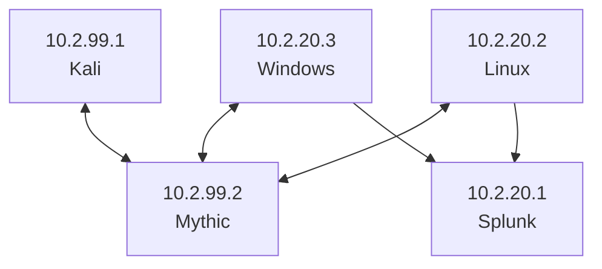

# Splunk-Mythic Attack Range

A range built so I can deploy C2 payloads and determine the logs a defender might see from the actions. 

## Machines

| Host    | IP        | VLAN |
| ------- | --------- | ---- |
| Splunk  | 10.2.20.1 | 20   |
| Windows | 10.2.20.3 | 20   |
| Linux   | 10.2.20.2 | 20   |
| Kali    | 10.2.99.1 | 99   |
| Mythic  | 10.2.99.2 | 99   |

## Network Rules

| Source  | Destination | Purpose         |
| ------- | ----------- | --------------- |
| Kali    | Mythic      | bi-directional  |
| Windows | Mythic      | bi-directional  |
| Linux   | Mythic      | bi-directional  |
| Linux   | Splunk      | uni-directional |
| Windows | Splunk      | uni-directional |

